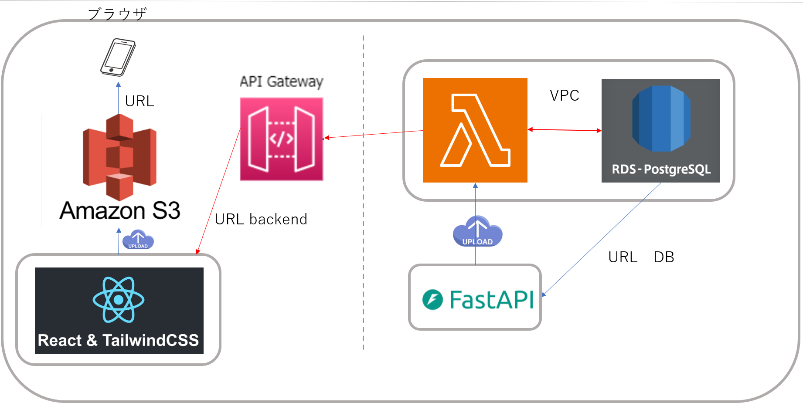

# Backend

## はじめに
私が使用している Python のバージョンは **3.11** です。  
仮想環境を使用してプロジェクト環境を作成することを推奨します。

まず、以下のコマンドを実行して、必要なパッケージをインストールします：
```bash
pip install -r requirements.txt
```

その後、以下のコマンドで FastAPI サーバーを起動できます：
```bash
uvicorn app.main:app --host 127.0.0.1 --port 8000 --reload
```
FastAPI の Swagger を利用すると、API の詳細を簡単かつ便利に確認できます。
**http://127.0.0.1:8000/docs** にアクセスすると、インタラクティブな API ドキュメントを確認できます。

このコマンドを実行すると、FastAPI の基本的なサーバーが立ち上がります。🚀

## データベースの導入と接続
※requirements.txtにライブラリを追加しているので、各自対応お願いします。

以下のURLからPostgreSQLをインストールしてください。バージョンは17です。
https://www.postgresql.org/download/windows/
* パスワードは任意
* ポートはデフォルト(5432)

ターミナルで以下を実行。

    psql -U postgres

設定したパスワードを入力するとPostgreSQLのターミナルに入れます。その後、以下のコマンドを実行。

    CREATE DATABASE mydatabase;
    CREATE USER myuser WITH PASSWORD 'mypassword';
    GRANT ALL PRIVILEGES ON DATABASE mydatabase TO myuser;

SQLのターミナルから抜け(ctrl+C)、以下を実行。

    psql -U postgres -h localhost -d mydatabase

PostgreSQLのターミナルに入れるので、以下を実行します。

    GRANT ALL PRIVILEGES ON SCHEMA public TO myuser;
    GRANT CREATE ON SCHEMA public TO myuser;

最後に、SQLのターミナルから抜け、以下を実行してください。

    python app/create_tables.py

以上で設定完了です！


## 想定中のバックエンド形

```
intern-2025-ml-backend/
│── app/                      # メインの FastAPI アプリケーション
│   ├── api/                  # API ルーティング関連
│   │   ├── endpoints/        # API エンドポイント（RESTful）
│   │   │   ├── auth.py       # ユーザー認証（登録、ログイン、JWT）
│   │   │   ├── users.py      # ユーザー管理（取得、更新、削除）
│   │   │   ├── ai.py         # AI 呼び出し（GPT/Claude との通信）
│   │   │   ├── rag.py        # RAG 関連 API（検索拡張生成、オプション）
│   │   ├── dependencies.py   # 依存関係（例：データベース依存）
│   ├── core/                 # 設定やセキュリティ関連
│   │   ├── config.py         # 設定ファイル（APIキー、DB接続、CORS）
│   │   ├── security.py       # セキュリティ管理（パスワードハッシュ化、JWT認証）
│   ├── models/               # データベースモデル（SQLAlchemy ORM）
│   │   ├── user.py           # ユーザーモデル（テーブル定義）
│   ├── schemas/              # データ検証 & シリアライズ（Pydantic）
│   │   ├── user.py           # ユーザーのリクエスト/レスポンスモデル
│   │   ├── ai.py             # AI 通信用の Pydantic モデル
│   ├── services/             # ビジネスロジック（Service 層）
│   │   ├── ai_service.py     # AI API 呼び出し（GPT、Claude など）
│   │   ├── user_service.py   # ユーザー管理ロジック（DB CRUD）
│   ├── database/                   # データベース管理
│   │   ├── session.py        # データベース接続（SQLAlchemy）
│   │   ├── crud.py           # 汎用データベース操作（CRUD）
│   ├── main.py               # FastAPI のエントリーポイント（アプリ初期化）
│── tests/                    # テストコード（pytest で実装）
│── .env                      # 環境変数ファイル（DB設定、APIキー）
│── requirements.txt          # 依存パッケージ（pip用）
│── README.md                 # プロジェクト概要
```
## インフラのデザイン



## AWS技術的に工夫した点

1. **Docker** を用いてローカルのファイルをアップロード  
2. **セキュリティ対策**（VPC、NAT Gateway、IP制限）  
3. **冗長性の確保**（AZ × 2）  
4. **CI/CD（Docker + GitHub Actions）**  
5. **CloudWatch + Slack 連携による監視**  
6. **S3 + React を用いた静的ファイルのデプロイ**  
7. **Lambda によるスケーラビリティの確保**
## デモ動画

<video width="600" controls>
  <source src="your-video.mp4" type="video/mp4">
  Your browser does not support the video tag.
</video>

